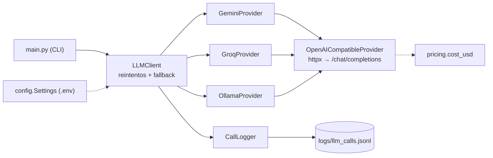

# Agente Operador

Proyecto integrador del **Bootcamp AI Engineer con Python — 2ª Edición: Agentes de IA en Producción** (Código Facilito).

El Agente Operador es un asistente para el equipo de operaciones de una empresa mediana: lee tickets (fallas, solicitudes, proveedores, facturación), los resume, los clasifica y, con el avance del bootcamp, actúa sobre ellos con herramientas, conocimiento interno y controles de producción.

En la Clase 1 construimos el **núcleo** (`core/`): un cliente LLM que habla con varios proveedores mediante el patrón adaptador, con reintentos, fallback, costo por llamada y logging estructurado.

## Qué se construye en cada bloque

| Bloque | Clases | Qué agrega al Agente Operador |
|---|---|---|
| Fundamentos | 1–3 | Cliente LLM multi-proveedor, prompting, manejo de contexto y contratos de salida |
| Agentes | 4–5 | Ciclo de agente con herramientas para actuar sobre los tickets |
| Conocimiento | 6–9 | Búsqueda sobre documentación interna (RAG) y memoria |
| Orquestación | 10–11 | Flujos de varios pasos y coordinación entre agentes |
| Evaluación | 12–13 | Conjuntos de prueba y métricas de calidad |
| Producción | 14–17 | Streaming, observabilidad, costos y despliegue |

## Requisitos e instalación

- Python 3.11 o superior
- [uv](https://docs.astral.sh/uv/)

```bash
uv sync
cp .env.example .env
```

Llena tu `.env` con las llaves:

| Variable | Dónde obtenerla |
|---|---|
| `GEMINI_API_KEY` | Google AI Studio: <https://aistudio.google.com/apikey> (tiene free tier) |
| `GROQ_API_KEY` | Groq Console: <https://console.groq.com/keys> (tiene free tier) |
| — | Ollama corre local y no necesita llave: <https://ollama.com/download>, luego `ollama pull llama3.2` |

Si falta la llave de algún proveedor que está en `PRIMARY` o `FALLBACKS`, el programa falla al arrancar y te dice qué variable agregar.

## Cómo correr

```bash
# Pregunta al LLM (usa PRIMARY y, si falla, FALLBACKS)
uv run main.py "Resume este ticket: el portal de proveedores no carga desde las 9:00"

# Demo de la clase: solo Gemini, sin fallbacks, con el ticket T-1043.
# Funciona aunque GroqProvider siga con su TODO.
uv run main.py --demo

# Fuerza un proveedor (sin fallbacks)
uv run main.py --provider ollama "hola"

# Tests (no usan red)
uv run pytest -q

# Calidad de código
uv run ruff check .
uv run ruff format --check .

# Reporte de las llamadas registradas en logs/llm_calls.jsonl
uv run scripts/report.py
```

Cada llamada imprime la respuesta y una línea gris con `proveedor · modelo · tokens in/out · latencia · costo`, y agrega una línea JSON por intento a `logs/llm_calls.jsonl`.

Los tickets de ejemplo están en `data/tickets_ejemplo.jsonl`.

## Arquitectura de `core/`



| Archivo | Responsabilidad |
|---|---|
| `core/config.py` | `Settings` leída de `.env`; valida llaves al arrancar |
| `core/errors.py` | Errores transitorios (se reintentan) y permanentes (fallback directo) |
| `core/providers.py` | `Provider` (Protocol), adaptador base compatible con OpenAI y uno por proveedor |
| `core/llm_client.py` | `LLMResponse` y `LLMClient`: backoff 1 s → 2 s → 4 s + jitter, fallback en orden |
| `core/logger.py` | Una línea JSON por intento, sin llaves ni texto del prompt |
| `core/pricing.py` | Precio por millón de tokens y costo por llamada |

## Práctica de la Clase 1

| Paso | Tiempo | Qué hacer |
|---|---|---|
| 1 | 5 min | Clona el repo y corre `uv sync` |
| 2 | 5 min | Copia `.env.example` a `.env` y agrega tus llaves |
| 3 | 15 min | Implementa `GroqProvider` en `core/providers.py` (busca `TODO(clase-1)`). Prueba con `uv run main.py --provider groq "hola"` |
| 4 | 5 min | Fuerza el fallback: `GEMINI_API_KEY=invalida uv run main.py "hola"`. Revisa en `logs/llm_calls.jsonl` el intento fallido y el `fallback: true` |
| 5 | 20 min | Completa `scripts/report.py`: costo total, latencia p50/p95, % de fallback y llamadas por proveedor |
| Bonus | — | Agrega `--temperature` (0–2) a `main.py` y pásalo al proveedor |

## Ver la solución

```bash
git switch solucion/clase-1
```

Para volver al inicio: `git switch main` (o `git checkout clase-1-inicio`).

## Avisos

- Gemini se consume con su [endpoint oficial compatible con OpenAI](https://ai.google.dev/gemini-api/docs/openai), que Google marca como **beta**. Desde junio de 2026 Google recomienda su API nativa, la [Interactions API](https://ai.google.dev/gemini-api/docs/interactions-overview), para proyectos nuevos. Aquí usamos la compatible con OpenAI para que Gemini, Groq y Ollama compartan un mismo adaptador base. Cambiar a la API nativa solo requiere otro adaptador en `core/providers.py`; el resto del código no se toca.
- Los precios en `core/pricing.py` son **ilustrativos**. Revisa la tabla vigente de cada proveedor antes de tomar decisiones con ellos.
- **Nunca subas tu `.env`** al repositorio. Ya está en `.gitignore`; si alguna vez lo subes por error, rota tus llaves.
