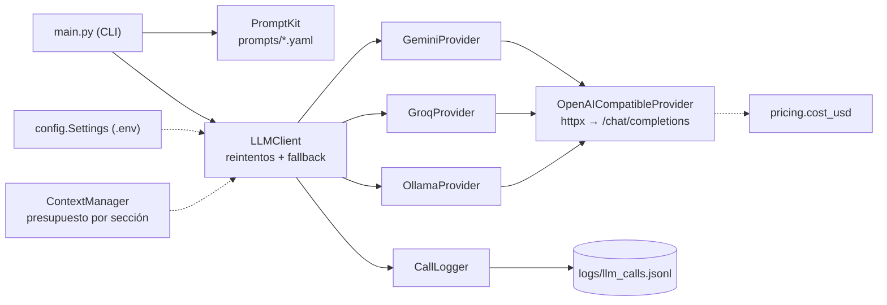

# Agente Operador

Proyecto integrador del **Bootcamp AI Engineer con Python — 2ª Edición: Agentes de IA en Producción** (Código Facilito).

El Agente Operador es un asistente para el equipo de operaciones de una empresa mediana: lee tickets (fallas, solicitudes, proveedores, facturación), los resume, los clasifica y, con el avance del bootcamp, actúa sobre ellos con herramientas, conocimiento interno y controles de producción.

- **Clase 1:** el núcleo (`core/`): un cliente LLM que habla con varios proveedores mediante el patrón adaptador, con reintentos, fallback, costo por llamada y logging estructurado.
- **Clase 2:** prompts versionados (`prompting/`, `prompts/`), contexto con presupuesto de tokens (`context/`) y pruebas de prompt injection.
- **Clase 3:** salida estructurada con contratos Pydantic y reparación (`contracts/`), y el primer tool call (`tools/`).

## Qué se construye en cada bloque

| Bloque | Clases | Qué agrega al Agente Operador |
|---|---|---|
| Fundamentos | 1–3 | Cliente LLM multi-proveedor, prompting, manejo de contexto y contratos de salida |
| Agentes | 4–5 | Ciclo de agente con herramientas para actuar sobre los tickets |
| Conocimiento | 6–9 | Búsqueda sobre documentación interna (RAG) y memoria |
| Orquestación | 10–11 | Flujos de varios pasos y coordinación entre agentes |
| Evaluación | 12–13 | Conjuntos de prueba y métricas de calidad |
| Producción | 14–17 | Streaming, observabilidad, costos y despliegue |

## Requisitos e instalación

- Python 3.11 o superior
- [uv](https://docs.astral.sh/uv/)

```bash
uv sync
cp .env.example .env
```

Llena tu `.env` con las llaves:

| Variable | Dónde obtenerla |
|---|---|
| `GEMINI_API_KEY` | Google AI Studio: <https://aistudio.google.com/apikey> (tiene free tier) |
| `GROQ_API_KEY` | Groq Console: <https://console.groq.com/keys> (tiene free tier) |
| — | Ollama corre local y no necesita llave: <https://ollama.com/download>, luego `ollama pull llama3.2` |

Si falta la llave de algún proveedor que está en `PRIMARY` o `FALLBACKS`, el programa falla al arrancar y te dice qué variable agregar.

## Comandos

Todo se corre con `uv run` desde la raíz del repo.

### `main.py`: la CLI del agente

```bash
# Pregunta al LLM (usa PRIMARY y, si falla, FALLBACKS)
uv run main.py "Resume este ticket: el portal de proveedores no carga desde las 9:00"

# Demo: solo Gemini, sin fallbacks, con el ticket T-1043 (funciona aunque GroqProvider esté pendiente)
uv run main.py --demo

# Fuerza un proveedor, sin fallbacks
uv run main.py --provider gemini "hola"
uv run main.py --provider groq "hola"
uv run main.py --provider ollama "hola"

# Clasifica un ticket de data/*.jsonl con un prompt versionado (Clase 2)
uv run main.py --prompt ticket_classifier --ticket T-1099                     # versión activa
uv run main.py --prompt ticket_classifier --prompt-version 1 --ticket T-1099  # versión específica
uv run main.py --prompt ticket_classifier "El ERP no abre desde la mañana"     # texto libre

# Salida estructurada y herramientas (Clase 3)
uv run main.py --structured --ticket T-1042
uv run main.py --tools "¿Cómo va el T-1042?"
```

Cada llamada imprime la respuesta y una línea gris con `proveedor · modelo · tokens in/out · latencia · costo`, y agrega una línea JSON por intento a `logs/llm_calls.jsonl`. Con `--prompt`, el log incluye `prompt_name` y `prompt_version`.

### Scripts

```bash
# Reporte de las llamadas registradas en logs/llm_calls.jsonl (reto de la Clase 1)
uv run scripts/report.py

# Compara versiones de un prompt sobre los 20 tickets etiquetados y los tickets de ataque
uv run scripts/compare_prompts.py ticket_classifier --versions 1 2
uv run scripts/compare_prompts.py ticket_classifier --versions 2 3 --no-attack
uv run scripts/compare_prompts.py ticket_classifier --versions 2 --provider ollama

# Muestra cómo el ContextManager recorta un historial largo (no llama al LLM)
uv run scripts/context_demo.py
uv run scripts/context_demo.py --budget-history 120
```

`compare_prompts.py` usa un solo proveedor sin fallback (el primario o el de `--provider`). `main.py --prompt` usa solo el primario si la cadena de fallbacks no se puede armar (por ejemplo, mientras `GroqProvider` esté pendiente).

### Tests y calidad de código

```bash
uv run pytest -q              # no usan red
uv run ruff check .
uv run ruff format --check .
```

### Datos

| Archivo | Contenido |
|---|---|
| `data/tickets_ejemplo.jsonl` | 10 tickets para la demo de la Clase 1 |
| `data/tickets_etiquetados.jsonl` | 20 tickets con su categoría (4 por categoría) para evaluar prompts |
| `data/tickets_ataque.jsonl` | Tickets con prompt injection, incluido `T-1099` |
| `prompts/ticket_classifier/examples.jsonl` | 10 ejemplos para few-shot (no se repiten con los de evaluación) |
| `data/tickets_db.json` | 50 tickets (`T-1001` a `T-1050`) con estado, equipo, proveedor e historial; los lee `buscar_ticket` |
| `data/proveedores.json` | 6 proveedores ficticios con servicio, SLA, estado y contacto (práctica de la Clase 3) |

## Arquitectura



| Archivo | Responsabilidad |
|---|---|
| `core/config.py` | `Settings` leída de `.env`; valida llaves al arrancar |
| `core/errors.py` | Errores transitorios (se reintentan) y permanentes (fallback directo) |
| `core/providers.py` | `Provider` (Protocol), adaptador base compatible con OpenAI y uno por proveedor |
| `core/llm_client.py` | `LLMResponse` y `LLMClient`: backoff 1 s → 2 s → 4 s + jitter, fallback en orden, `log_extra` |
| `core/logger.py` | Una línea JSON por intento, sin llaves ni texto del prompt |
| `core/pricing.py` | Precio por millón de tokens y costo por llamada |
| `prompting/promptkit.py` | `PromptKit` y `Prompt`: carga YAML versionados y los renderiza con Jinja2 |
| `context/manager.py` | `ContextManager`: arma el contexto respetando un presupuesto de tokens por sección |
| `contracts/ticket.py` | `TicketClassification`: contrato de salida del triage |
| `contracts/structured_output.py` | `generate_structured`: pide JSON, lo valida con Pydantic y repara |
| `contracts/tool_schemas.py` | `ToolSpec` y `BUSCAR_TICKET`: qué recibe cada herramienta y cómo se describe |
| `contracts/tool_loop.py` | `run_tool_loop` y `execute_tool`: el ciclo de herramientas con `MAX_ITERS` |
| `tools/tickets.py` | `buscar_ticket` sobre `data/tickets_db.json` |

## Clase 2: prompt engineering y context engineering

- **Prompts versionados:** los prompts salen del código y viven en YAML con versión. Así se comparan versiones con datos, se registra en el log qué versión respondió y se cambia de versión sin tocar Python.
- **Contexto con presupuesto:** el `ContextManager` reparte tokens por sección (system, ejemplos, historial, documentos, pregunta y salida reservada). Si algo no cabe, descarta lo de menor prioridad y más antiguo, y nunca recorta el system.
- **Prompt injection:** los tickets de `data/tickets_ataque.jsonl` intentan darle órdenes al clasificador. Los delimitadores de la v2 reducen el riesgo, pero no lo eliminan.

### Formato de un archivo de prompt

Cada prompt vive en `prompts/<nombre>/v<N>.yaml`:

```yaml
name: ticket_classifier        # igual al nombre de la carpeta
version: 2                     # igual al número del archivo (v2.yaml)
active: true                   # exactamente una versión activa por prompt
description: Clasificador con delimitadores y categoría "otro".
model_params:                  # se pasan tal cual al proveedor
  temperature: 0
  max_tokens: 10
system: |
  Eres el clasificador de tickets del equipo de operaciones de {{ company }}.
  ...
user: |
  <ticket>{{ ticket }}</ticket>
```

- Las plantillas son Jinja2 con `StrictUndefined`: si falta una variable, falla y dice cuál.
- `categories` y `examples` (de `examples.jsonl`, si existe en la carpeta) están disponibles en la plantilla sin pasarlos.
- `PromptKit().get("ticket_classifier")` devuelve la versión con `active: true`; `get("ticket_classifier", 1)` devuelve la v1 aunque no esté activa. Si hay cero o más de una activa, falla y dice qué archivos revisar.
- Categorías válidas: `falla`, `solicitud`, `proveedor`, `facturacion`, `otro`.

## Clase 3: salida estructurada, contratos y primer tool call

- **Salida estructurada:** `generate_structured()` pide al modelo un JSON que cumpla un modelo Pydantic y lo valida localmente con `model_validate_json()`.
- **Contrato `TicketClassification`** (`contracts/ticket.py`): `razon` va primero a propósito (el modelo justifica antes de decidir), `categoria` y `prioridad` son `Literal`, `resumen` tiene máximo 280 caracteres y un validador exige prioridad alta si hay una caída.
- **Reparación:** si la respuesta no valida, se agrega al historial la respuesta cruda y el error en lenguaje claro, y se reintenta (máximo `max_repairs`). Un error del proveedor no se repara: se propaga.
- **Primer tool call:** `buscar_ticket` (`tools/tickets.py`) con su contrato `ToolSpec` y el ciclo mínimo `run_tool_loop` (`contracts/tool_loop.py`): `for` con `MAX_ITERS = 3`, nunca `while True`. Los errores de herramientas se le regresan al modelo como `{"error": ...}`, sin traceback.

### Capacidades por proveedor

Verificado el 2026-10-09 en la documentación oficial. La estrategia de `generate_structured` depende del proveedor primario: `json_schema` estricto, si no `json_object` más el schema en el system, y si no solo el schema en el system.

| Proveedor | `supports_tools` | `supports_json_schema` | `supports_json_object` | Documentación |
|---|---|---|---|---|
| Gemini | ✅ | ✅ | ❌ (no documentado) | [OpenAI compatibility](https://ai.google.dev/gemini-api/docs/openai), [Structured output](https://ai.google.dev/gemini-api/docs/structured-output) |
| Groq (`openai/gpt-oss-*`) | ✅ (defaults de la clase base) | ✅ | ✅ | [Tool use](https://console.groq.com/docs/tool-use), [Structured outputs](https://console.groq.com/docs/structured-outputs) |
| Ollama | ✅ | ❌ (no confirmado) | ✅ (JSON mode) | [OpenAI compatibility](https://docs.ollama.com/api/openai-compatibility) |

Detalles que importan:

- **Gemini 3** regresa cada tool call con `extra_content` (su *thought signature*). Hay que reenviarlo tal cual en el siguiente turno; si falta, responde 400. `ToolCall` lo guarda y `LLMResponse.as_message()` lo devuelve.
- **Groq** con `strict: true` exige `additionalProperties: false` y que todas las propiedades estén en `required`. `openai/gpt-oss-120b` no soporta tool calls en paralelo y la página no menciona `tool_choice`.
- **Ollama** no soporta `tool_choice`.
- **Schema que se envía:** `sanitize_schema()` quita `maxLength`, `minLength`, `pattern`, `title` y `default`, y resuelve `$defs`. Solo cambia la copia que se manda; Pydantic sigue validando el modelo completo en local.

### Comandos

```bash
# Triage con salida estructurada (imprime un TicketClassification en JSON)
uv run main.py --structured --ticket T-1042

# Pregunta con herramientas: muestra cada tool call (→) y su resultado (←)
uv run main.py --tools "¿Cómo va el T-1042?"
uv run main.py --tools "¿Cómo va el T-9999?"     # la herramienta regresa un error y el modelo lo explica
```

Cada llamada queda en `logs/llm_calls.jsonl` con `structured_schema` y `repair_attempt` (salida estructurada) o `tool_iteration` y `tool_calls` (solo los **nombres** de las herramientas pedidas, nunca sus argumentos).

## Retos

### Reto de la Clase 1: proveedor de respaldo y reporte

La solución ya está publicada: `GroqProvider` en `core/providers.py` y `scripts/report.py`.

| Paso | Qué hacer |
|---|---|
| 1 | Implementa `GroqProvider` en `core/providers.py`. Pista: mira `GeminiProvider`. Prueba con `uv run main.py --provider groq "hola"` |
| 2 | Fuerza el fallback: `GEMINI_API_KEY=invalida uv run main.py "hola"`. Revisa en `logs/llm_calls.jsonl` el intento fallido y el `fallback: true` |
| 3 | Completa `scripts/report.py`: costo total en USD, latencia p50 y p95 de las llamadas exitosas, % de llamadas con fallback y llamadas por proveedor. Solo librería estándar; maneja el caso de que el log no exista o esté vacío |
| Bonus | Agrega `--temperature` (0–2) a `main.py` y pásalo al proveedor |

### Reto de la Clase 2: un clasificador v3 con few-shot

1. Corre la línea base y anota qué tickets falla cada versión:
   ```bash
   uv run scripts/compare_prompts.py ticket_classifier --versions 1 2
   ```
2. Crea `prompts/ticket_classifier/v3.yaml` con **few-shot**: usa los ejemplos de `examples.jsonl`, que llegan a la plantilla como `examples` (cada uno con `ticket` y `categoria`). Ponle `active: true` y cambia la v2 a `active: false`.
3. Supera a la v2:
   ```bash
   uv run scripts/compare_prompts.py ticket_classifier --versions 2 3
   uv run main.py --prompt ticket_classifier --ticket T-1099
   ```
4. **Comparte tus resultados en la tabla común** del grupo con estas columnas:

   | Nombre | Modelo | Versión | Aciertos | Fuera de formato | Tokens prom. | Costo/1k tickets | Ataques resistidos | ¿Resiste T-1099? |
   |---|---|---|---|---|---|---|---|---|
   | Referencia | `gemini-3.5-flash-lite` | v1 | 16/20 | 0 | 68 | $0.0257 | 3/5 | No |
   | Referencia | `gemini-3.5-flash-lite` | v2 | 18/20 | 0 | 183 | $0.0601 | 4/5 | Sí |
   | Tu nombre | | v3 | | | | | | |

Opcional: migra el system prompt de `main.py` (busca `TODO(clase-2)`) a `prompts/operator_assistant/v1.yaml` y cárgalo con `PromptKit`.

> Los resultados varían por modelo y entre corridas. Con 20 tickets, cada ticket vale 5 puntos porcentuales: no saques conclusiones de una diferencia de uno o dos tickets. Más ejemplos también significan más tokens: compara el costo, no solo los aciertos.

### Práctica de la Clase 3: combinar dos herramientas

1. Crea `ConsultarProveedorArgs` y su `ToolSpec` (`CONSULTAR_PROVEEDOR`) en `contracts/tool_schemas.py` (busca `TODO(clase-3)`), con una buena descripción: qué hace, cuándo usarla y cuándo **no**.
2. Implementa `consultar_proveedor(nombre)` en `tools/` sobre `data/proveedores.json`.
3. Registra la herramienta en `TOOLS` de `main.py`, junto a `BUSCAR_TICKET`.
4. Logra que el modelo combine ambas herramientas:
   ```bash
   uv run main.py --tools "¿El T-1042 depende de algún proveedor? ¿Cuál es su SLA?"
   ```
   Está listo cuando `logs/llm_calls.jsonl` muestra las dos herramientas (`buscar_ticket` y `consultar_proveedor`) en la misma request.

## Avisos

- Gemini se consume con su [endpoint oficial compatible con OpenAI](https://ai.google.dev/gemini-api/docs/openai), que Google marca como **beta**. Desde junio de 2026 Google recomienda su API nativa, la [Interactions API](https://ai.google.dev/gemini-api/docs/interactions-overview), para proyectos nuevos. Aquí usamos la compatible con OpenAI para que Gemini, Groq y Ollama compartan un mismo adaptador base. Cambiar a la API nativa solo requiere otro adaptador en `core/providers.py`; el resto del código no se toca.
- En el free tier de Gemini, `compare_prompts.py` puede recibir errores 429 (límite por minuto). El script reintenta con esperas de hasta ~1 minuto; si un ticket aun así falla, se reporta como error del proveedor y no como fuera de formato.
- El validador `caida_es_alta` de `TicketClassification` es una **simplificación didáctica**: busca la palabra "caíd" en el texto. Una regla real usaría un campo explícito.
- Los precios en `core/pricing.py` son **ilustrativos**. Revisa la tabla vigente de cada proveedor antes de tomar decisiones con ellos.
- **Nunca subas tu `.env`** al repositorio. Ya está en `.gitignore`; si alguna vez lo subes por error, rota tus llaves.
